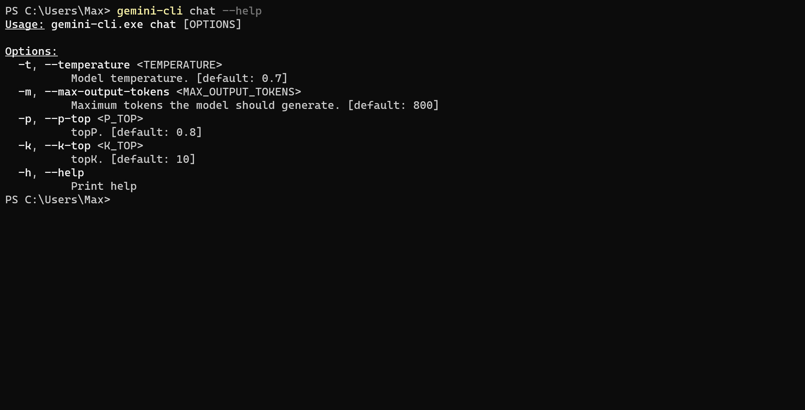

# `gemini-cli`

Simple chat routine to interact with Googles gemini-pro LLM.

## Prerequisite

Add your Google API key to the following env variable `GOOGLE_API_KEY`.

## Installation - Windows

1. clone this repo
2. build gemini-cli .exe via `cargo build --release`
3. add the gemini-cli .exe path to your env variables:
    - System Properties
    - Environment Variables...
    - System Variables
    - Path
    - Edit
    - New
    - add path to the `release` directory which contains the .exe

## Use

### `gemini-cli chat`

This will launch `gemini-cli` in chat mode. Your GPT assistant will keep track of your conversation.

#### Commands within chat

##### `exit`

- will terminate the conversation

##### `clear`

- clears the whole chat history. The conversation will start from scratch.

##### `undo`

- will remove the last request and answer from the chat history.

#### Parameters

